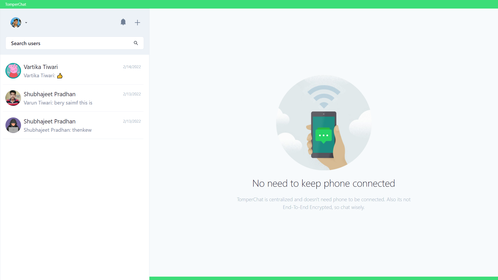
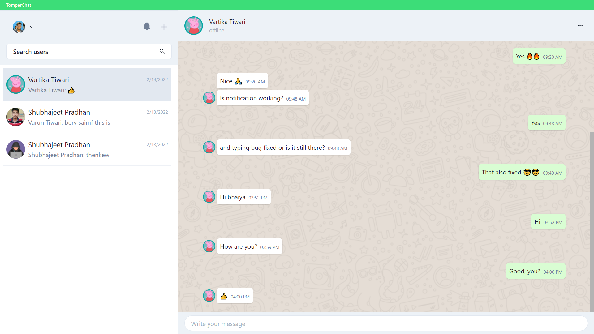

  

  <b>WhatsApp Clone Built Using MERN Stack + Socket.IO + Flask AI</b>

  <a href='https://tomper-chat.onrender.com/' target='_blank'>tomper-chat.onrender.com</a> (cloud-based)  
   
  <a href='https://tc.varuntiwari.com' target='_blank'>tc.varuntiwari.com</a> (self-hosted)

---

  This is the frontend + backend of a chat app built with the MERN stack and hosted with <a href='https://www.render.com/' target='_blank'>Render</a>.

  
    
  

---

## 🧾 Description

**Chatty** is a WhatsApp clone designed for educational and professional collaboration. It uses the **MERN stack** with **Socket.IO** for real-time chat features such as online status, typing indicators, and instant notifications.

The standout feature is the **AI-Powered Message Expansion**, built with a **Flask-based generative model**. This lets users preview short messages and expand them into full-length suggestions with a single click — perfect for students, teachers, and professionals who want to communicate quickly but meaningfully.

---

## ✨ Features

- ✅ User authentication (JWT-based)
- ✅ Search for users to chat with
- ✅ Create and manage group chats
- ✅ Only group admins can edit group info or manage users
- ✅ Leave group chats anytime
- ✅ Real-time private & group messaging via [Socket.IO](https://socket.io/)
- ✅ Realtime user online/offline status
- ✅ Typing indicators for private and group chats
- ✅ Instant notifications for new messages
- ✅ Mobile & desktop responsive
- ✅ **AI-based message generator using Flask** (expand short → full messages)
- 😎 WhatsApp-Web-like interface

---

## 🙄 TODO

- [ ] Add message deletion
- [ ] create group
- [ ] add members to group
- [ ] Allow group admins to delete groups

---

## ⚙ Tools and Technologies Used

### 🧩 Frontend

- [React.js](https://reactjs.org/)
- [Chakra UI](https://chakra-ui.com/)
- [React Icons](https://react-icons.github.io/react-icons/)

### ⚙ Backend

- [Node.js](https://nodejs.org/en/)
- [Express.js](https://expressjs.com/)
- [MongoDB](https://www.mongodb.com/)
- [JWT](https://jwt.io/)
- [Socket.IO](https://socket.io/)
- [Cloudinary](https://cloudinary.com/) – For image uploads
- [Bcrypt.js](https://github.com/dcodeIO/bcrypt.js) – For password hashing

### 🧠 AI Integration (Message Generator)

- [Flask](https://flask.palletsprojects.com/) – Lightweight Python web framework
- [Gemini AI API]* – For generating expanded text messages *(based on your implementation)*

